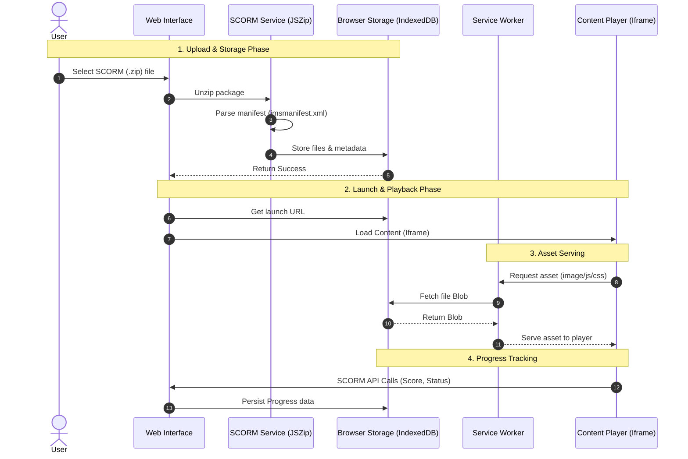

# SCORM Demo App Specification

This document provides a detailed technical specification for the SCORM Demo App. While the `README.md` serves as an onboarding guide, this document is intended for deep technical reference.

---

## 1. Tech Stack

### Core Frameworks
- **Framework**: [Next.js 15+](https://nextjs.org/) (App Router) - Provides the foundation for routing, server actions, and optimized rendering.
- **Language**: [TypeScript](https://www.typescriptlang.org/) - Ensures type safety and improves maintainability across the codebase.
- **Styling**: 
  - **Tailwind CSS**: Used for utility-first styling and rapid UI development.
  - **CSS Modules**: Used within the Atomic Design components for scoped, component-specific styling.

### Specialized Libraries
- **SCORM Runtime**: [scorm-again](https://github.com/cedu-fai-ucc/scorm-again) - Handles the heavy lifting of SCORM 1.1, 1.2, and 2004 API implementation.
- **Package Processing**: [JSZip](https://stuk.github.io/jszip/) - Used for client-side extraction of SCORM `.zip` packages.
- **State Management**: [Zustand](https://docs.pmnd.rs/zustand/getting-started/introduction) - A lightweight store for managing SCORM API state and UI transitions.
- **Storage**: **IndexedDB** - Utilized for persistent local storage of extracted SCORM content and user progress.

---

## 2. Key Features

### 2.1 SCORM Upload & Processing
- **Architecture**: Purely client-side processing to bypass platform payload limits (e.g., Vercel's 4.5MB limit).
- **Extraction**: Uses `JSZip` to extract package contents directly into browser memory.
- **Manifest Parsing**: Uses `DOMParser` to analyze `imsmanifest.xml` (or `CSF.xml`) to identify resources, entry points, and SCORM version.
- **Validation**: 
  - Mandatory manifest file detection.
  - Runtime version detection (SCORM 1.1, 1.2, or 2004).
  - Maximum file size support: **25MB+**.

### 2.2 SCORM Player (RTE)
- **Runtime Environment**: Implements `API` (1.2) and `API_1484_11` (2004) windows objects.
- **Iframe Isolation**: Content is rendered in a sandboxed `iframe` to prevent cross-scripting issues between the course and the LMS interface.
- **Data Model Handling**: Supports standard calls: `Initialize`, `Terminate`, `GetValue`, `SetValue`, `Commit`, and `GetLastError`.
- **SCO Navigation**: Support for multi-SCO packages with navigation tree (if defined in manifest).

### 2.3 Course Library
- **Persistence**: Extracted files and metadata are stored in IndexedDB.
- **Dashboard View**: A grid layout displaying uploaded courses with metadata (Title, Version, Last Accessed).
- **Progress Tracking**: 
  - Tracks `cmi.completion_status` and `cmi.success_status`.
  - Visual progress bars based on `cmi.progress_measure` or score.
- **Management**: Ability to launch, resume, or delete courses.

### 2.4 Analytics & Debugging
- **Live RTC Log**: (Planned) A real-time console showing communication between the course and the LMS.
- **Data Explorer**: (Planned) A visual tree view to inspect the current session's SCORM data model (CMI).
- **Session Reports**: Detailed breakdown of session time, score distribution, and interaction history.

---

## 3. Design System

### 3.1 Project Structure (Atomic Design)
The project follows **Atomic Design** to maintain a separation of concerns and maximize component reuse.

```text
src/
├── app/                  # Next.js App Router (pages, actions, API)
├── components/           # UI Components (Atomic Design)
│   ├── atoms/            # Smallest units (Buttons, Icons, Tooltips)
│   ├── molecules/        # Groups of atoms (Uploader, Search bar, Nav items)
│   ├── organisms/        # Complex sections (ScormPlayer, Dashboard grid)
│   ├── templates/        # Page-level layouts
│   └── providers/        # Context providers (Zustand, SW registration)
├── hooks/                # Custom React hooks (e.g., useScormApi)
├── services/             # Business logic (scorm.service.ts, zip.utils.ts)
├── store/                # Global state (Zustand stores)
├── utils/                # Helper utilities (db.ts for IndexedDB)
└── types/                # Shared TypeScript interfaces & types
```

### 3.2 Naming Conventions
- **Folders**: Must use `camelCase` (e.g., `src/components/scormPlayer`).
- **Files**: All files must use `camelCase` (e.g., `scormPlayer.tsx`, `scorm.service.ts`).
- **Components**: While files are `camelCase`, the React components within them use `PascalCase`.
- **Hooks**: Prefixed with `use` (e.g., `useScormStore`).

### 3.3 Barrel Style Usage
To keep imports clean, each component directory uses an `index.ts` file. This allows consumers to import from the folder level rather than deep-nesting into specific files.

**Example Folder Structure (`scormPlayer`):**
```text
src/components/organisms/scormPlayer/
├── scormPlayer.tsx             # Main component logic
├── scormPlayer.module.css      # Scoped styles
├── scormPlayer.stories.tsx     # Storybook documentation
├── scormPlayer.spec.tsx        # Unit/Integration tests
└── index.ts                    # Barrel export
```

**Implementation Example:**

```tsx
// 1. scormPlayer.tsx
import styles from './scormPlayer.module.css';
export const ScormPlayer = () => <div className={styles.container}>...</div>;

// 2. index.ts (Barrel)
export * from './ScormPlayer';

// 3. Consumer usage (app/page.tsx)
import { ScormPlayer } from '@/components/organisms';
```

**Supporting Files:**
- **`.stories.tsx`**: Used for isolated UI testing and documentation via Storybook.
- **`.spec.tsx`** or **`.test.tsx`**: Contains unit tests (Vitest/Jest) ensuring component reliability.
- **`.module.css`**: CSS Modules for local scoping, preventing class name collisions.

### 3.4 Theme & UI Configuration
- **Visual Style**: Minimalist, clean, with a focus on usability.
- **Glassmorphism**: Subtle use of transparency and blurs for overlays and modals.
- **Color Palette**: 
  - **Primary**: Soft Pink/Secondary accents (configurable via `globals.css` variables).
  - **Background**: High-contrast white/off-white for readability.

**Example: Changing the Primary Color**
To update the theme's core identity, modify the CSS variables in `src/app/globals.css`. These variables are mapped to the Tailwind configuration.

```css
/* src/app/globals.css */
:root {
  /* Change from Pink to Ocean Blue */
  --color-primary: 14 165 233;       /* sky-500 RGB */
  --color-primary-light: 186 230 253; /* sky-200 RGB */
}
```
- **Typography**: Modern sans-serif (Inter/Outfit) optimized for web performance.

---

## 4. Non-Functional Requirements

### 4.1 Performance & Serving
- **Service Worker Interception**: A custom `sw.js` intercepts requests targeting `/api/content/...`. It retrieves the requested resource from IndexedDB as a `Blob` and returns it as a standard HTTP response.
- **Client-Side Serving**: This avoids all server round-trips for course assets (images, JS, CSS), leading to near-instant loading and offline capability.

### 4.2 Storage & Persistence
- **IndexedDB**: Chosen over `localStorage` due to the large size of SCORM packages. 
- **Database Schema**:
  - `courses`: Stores manifest data and generic metadata.
  - `files`: Stores raw Blob data for every file in the ZIP.
  - `progress`: Stores JSON blobs of the SCORM data model per user/course.

### 4.3 Security
- **Origin Isolation**: Service workers only serve content within their scope.
- **Iframe Sandboxing**: Restricts course content from accessing parent window cookies or sensitive local storage data.

### 4.4 Navigation & Layout
- **Global Navigation**: Top-bar navigation for Dashboard, Library, and Analytics.
- **Responsive Design**: Mobile-friendly layout using Tailwind's responsive utilities.


### 4.5 Life Cycle of SCORM Package
The following diagram illustrates the high-level lifecycle of a SCORM package, from initial upload to interactive playback.


